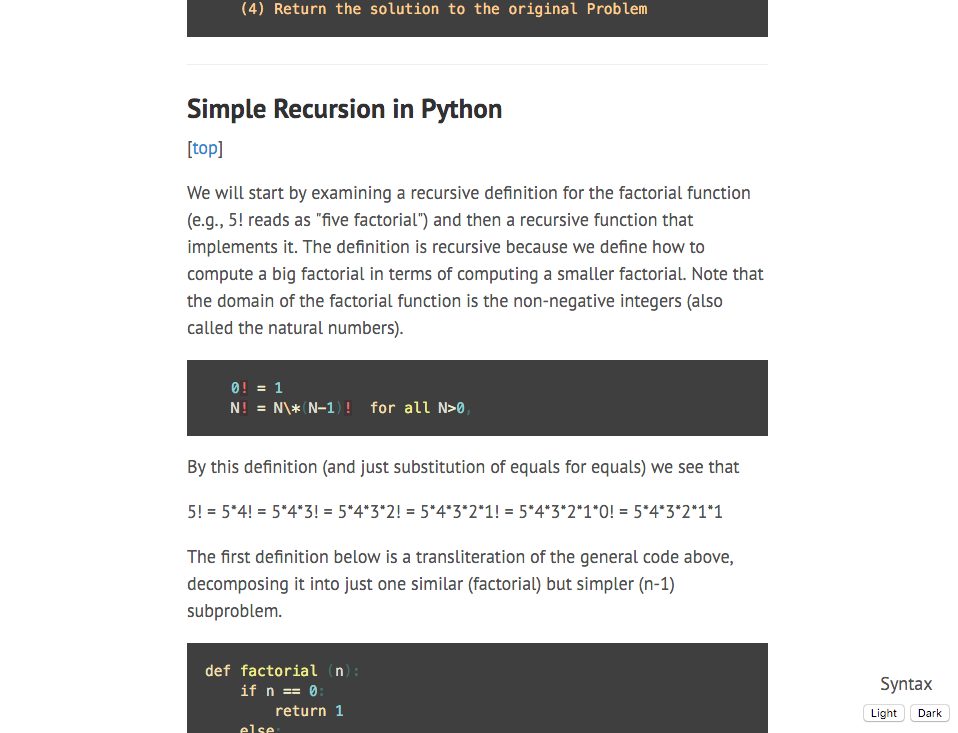

# Prettify

This code attempts to format the notes for Dr. Richard Pattis' ICS-33 class at UC Irvine into something colorful and more easily navigated.  Some links:

* [Course website](https://www.ics.uci.edu/~pattis/ICS-33/)
* [Weekly schedule, HW, notes](https://www.ics.uci.edu/~pattis/ICS-33/lectures.html)
* [Notes in .txt format](https://www.ics.uci.edu/~pattis/ICS-33/lectures/)
* [Brayan Gallardo's winning entry, with handy navigation](http://www.ics.uci.edu/~brgallar/index.html)

## How it works
This project is coded in Python.  The script does the following:

1. The text files are examined, and each line is labeled as code, diagram, list, etc.
1. Depending on the line designations, Markdown formatting is applied.  We also:
    1. Protect characters that Markdown would normally treat as special,
    1. Build a table of contents at the top of the document.
1. The Markdown is rendered to HTML, and some extra HTML bits are added so that we can use some nice CSS.

### Try it out!
To try it out, make sure you have the Python modules in _requirements.txt_ installed.  Place any text files you want to convert into the _notes_ folder, and then run the main script.  Peek through the code to figure out what the arguments for pretty( ) do.  Launch an .html file from your computer, or see a [sample output](http://ryan-holben.github.io/output1.html) here (last updated 4/3/2016).

## Challenges, and why this is interesting
It turns out that it is easy for a human to recognize a diagram, a code block, or even inline code contained within a sentence, but programming this algorithmically can be quite a challenge!  Can you precisely state how you differentiate between code and natural language?  The solution here works often, but not always, and so there is always room for improvement.  

## The next steps
There are a number of places one could work next:
* Improve the code-recognition algorithms.
* Improve the diagram-recognition algorithm.
* The code currently returns the table of contents data back to the main script.  A natural next step would be to generate a nice navigation for all of the note files which includes these subtopics.
* Squash bugs and introduce more robust error-handling.
* Other details, such as detecting and adding hyperlinks

## Bugs
This script was developed using _recursion.txt_, and it works pretty well with it!  However, it has mixed results with other text files.  In particular, when applying the script to other files the following things may happen:
* Some diagrams are borked
* An example edge case (or bug) which is not yet handled was found in _decoratorspackages.txt_:

> line 141, in find_lists
> > k = line_starts_with_enumeration(lines[j+1][1])

> ERROR: list index out of range

In short, the original notes are not completely consistent, so we still must check against the files for some edge cases.
